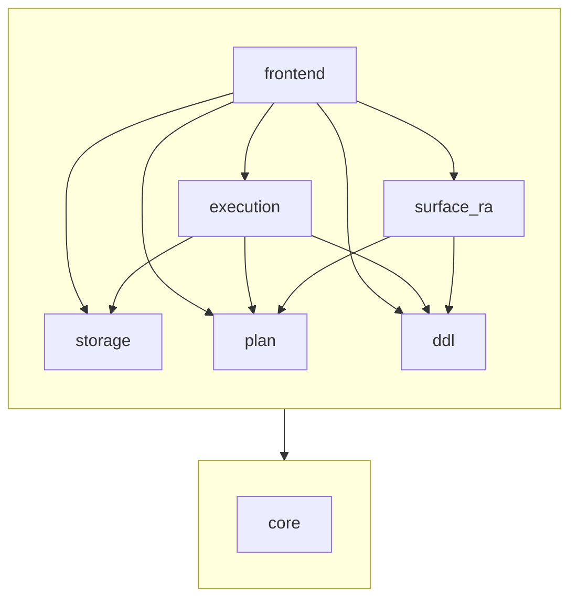

# Architecture

How the pieces of Dovetail fit together: the query pipeline from text to
tuples, the storage stack underneath it, the shared data types, and the
sub-library layout in `lib/`.

## Layer diagram

The query pipeline runs top-to-bottom from text to tuples and back to text.
The storage stack sits below it, used by `Eval` and the catalog.

```
  Query pipeline                                  Storage stack
  ──────────────                                  ─────────────

  "users | join orders on users.id = orders.user_id"
         │
         │  Parser   (angstrom)
         ▼
       Ast.t        — surface AST; mirrors syntax
         │
         │  Lower
         ▼
     Logical.t      — relational algebra; what the query computes
         │
         │  Translate
         ▼
     Physical.t     — physical operators; how to compute it
         │
         │  Eval ────────────────────────────►  Catalog       — name → Relation.kind
         ▼                                          │
     Relation.t     — kind + Seq.t of Row.data      │  uses
         │                                          ▼
         │  Relation.print                      Encoding      — keys (byte-
         ▼                                          │          comparable),
       output                                       │          tuple values
                                                    │          (Marshal)
                                                    │  uses
                                                    ▼
                                                Storage       — LMDB env, txns,
                                                    │          byte-keyed maps
                                                    ▼
                                                  LMDB
```

`Demo_data` sits beside `Catalog` and the storage stack, seeding
the example `users` and `orders` tables through the public DDL/DML
surface when the binary is launched with `--demo-data`. Production
runs ship no hardcoded rows; the seeder is opt-in.

## Layers

### Query pipeline

| Layer       | Type                                     | Role                                                                                                                       |
| ----------- | ---------------------------------------- | -------------------------------------------------------------------------------------------------------------------------- |
| `Parser`    | `string -> (Ast.t, error) result`              | Surface syntax → AST, built on `angstrom`. Bare identifiers and `\|`-separated `restrict`, `project`, `cross`, and `join ... on` pipeline steps so far. |
| `Ast`       | `t = Relation_name \| Restrict \| Project \| CrossProduct \| Join \| ...` | What the user typed, structured. No semantics yet.                                                                                |
| `Lower`     | `Ast.t -> Logical.t`                           | Replace each syntactic node with the algebraic operator it denotes. `Ast.Join` desugars to `Logical.Restrict (Logical.CrossProduct ..., predicate)`. |
| `Logical`   | `t = Scan \| Restrict \| Project \| CrossProduct \| ...` | Algebra: *what* the query computes, with no execution detail. `Restrict` is σ; `Project` is π; `CrossProduct` is ×.                  |
| `Translate` | `catalog:(string -> Relation.kind option) -> Logical.t -> Physical.t` | Pick a physical strategy per operator. Folds `Restrict` over `CrossProduct` into a single `NestedLoopJoin`; folds `Restrict (Scan, pk = literal)` into an `IndexLookup` when the catalog says the PK matches. Future home of further optimisation. |
| `Physical`  | `t = FullScan \| Filter \| Project \| CrossProduct \| IndexLookup \| NestedLoopJoin \| ...` | Concrete execution plan: cursors, filters, projections, nested-loop cross product and join, primary-key point lookups, future hash joins, etc. |
| `Predicate` | `t = Compare {...}`                            | Predicate sublanguage shared by `Logical.Restrict` and `Physical.Filter`. Each side is a column ref (bare or `qualifier.name`) or a literal. `Predicate.resolve` validates and caches lookup. |
| `Projection`| `t = Row.column_reference list`             | Projection sublanguage shared by `Logical.Project` and `Physical.Project`. `Projection.resolve` validates and returns a row-rewriter.|
| `Eval`      | `env -> txn -> Physical.t -> Relation.t` | Volcano executor. Each operator returns a `Relation.t` whose `data` seq is pulled lazily.                                  |
| `Relation`  | `'tag t = { kind; data }`                | Kind-tagged stream of rows. Phantom `'tag` distinguishes set vs bag semantics.                                             |

### Storage stack

| Layer      | Role                                                                                        |
| ---------- | ------------------------------------------------------------------------------------------- |
| `Storage`  | Thin wrapper over LMDB. Env, scope-bound read/write transactions, byte-keyed sub-databases. |
| `Encoding` | Byte-comparable key encoding (sign-flipped BE for `int64`); `Marshal` for tuple values.     |
| `Catalog`  | Persistent table-name → `Relation.kind` map, backed by a single `catalog` subDB.            |

### Data types

| Module   | What it carries                                                                                    |
| -------- | -------------------------------------------------------------------------------------------------- |
| `Value`    | `Int64 \| String \| Bool` runtime values, plus a parallel `Value.kind` for static kind declarations.                                          |
| `Row`      | `Row.kind` is an ordered list of named, typed, optionally qualified fields. `Row.data = Value.data array` is the values in field order.       |
| `Relation` | `Relation.kind = { row_kind; refinements }` adds refinements (currently just `Primary_key`). `Relation.t` is a kind plus a `Row.data Seq.t`.  |

`Value`, `Row`, and `Relation` form a deliberate three-rung type
ladder; see [`type-ladder.md`](type-ladder.md) for the per-rung
`kind`/`data`/`t` pattern and the rules for adding refinements.

## Sub-library dependencies

Internal dependencies between the sub-libraries under `lib/`. External
packages (`lmdb`, `unix`, `angstrom`) are omitted.

`core` is depended on by every other sub-library, so the diagram shows
it as a foundation layer with a single arrow from the upper layer
rather than repeating the edge seven times.


