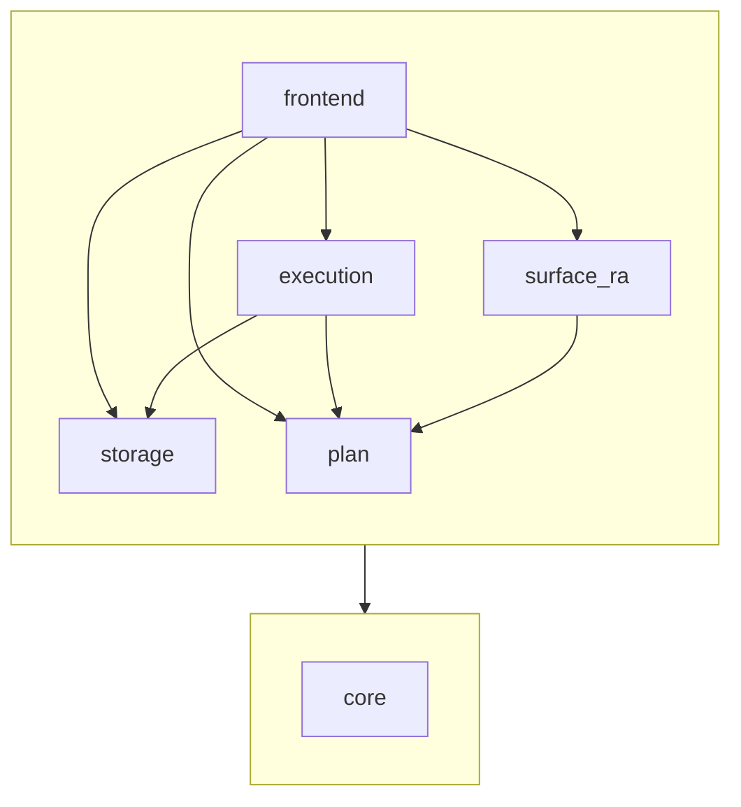

# Architecture

How the pieces of Dovetail fit together: the query pipeline from text to
rows, the storage stack underneath it, the shared data types, and the
sub-library layout in `lib/`.

## Layer diagram

The query pipeline runs top-to-bottom from text to rows and back to text.
The storage stack sits below it, used by `Eval` and the catalog.

```
  Query pipeline                                  Storage stack
  ──────────────                                  ─────────────

  "users | join orders on users.id = orders.user_id"
         │
         │  Parser   (angstrom)
         ▼
       Ast.t        — surface AST; mirrors syntax
         │
         │  Lower
         ▼
     Logical.t      — relational algebra; what the query computes
         │
         │  Translate
         ▼
     Physical.t     — physical operators; how to compute it
         │
         │  Eval ────────────────────────────►  Catalog       — name → Relation.kind
         ▼                                          │
     Term.t       — Scalar/Row/Relation: value/kind │  uses
         │                                          ▼
         │  Term.format                         Encoding      — keys (byte-
         ▼                                          │          comparable),
       output                                       │          row values
                                                    │          (Marshal)
                                                    │  uses
                                                    ▼
                                                Storage       — LMDB env, txns,
                                                    │          byte-keyed maps
                                                    ▼
                                                  LMDB
```

`Demo_data` sits beside `Catalog` and the storage stack, seeding
the example `users` and `orders` tables through the public surface
(the `create table` and `insert into` pipe-form operators) when the
binary is launched with `--demo-data`. Production runs ship no
hardcoded rows; the seeder is opt-in.

## Layers

### Query pipeline

| Layer       | Type                                     | Role                                                                                                                       |
| ----------- | ---------------------------------------- | -------------------------------------------------------------------------------------------------------------------------- |
| `Parser`    | `string -> (Ast.t, error) result`              | Surface syntax → AST, built on `angstrom`. The whole language is pipe-shaped: every input is a relational pipeline. |
| `Ast`       | `t = Relation_name \| Restrict \| Project \| CrossProduct \| Join \| Insert \| Unqualify \| Type \| Scalar_literal \| Row_literal \| Relation_literal \| Drop_table \| Create_table_empty \| Create_table_seeded \| Catalog_source \| Tables` | What the user typed, structured. No semantics yet. `Insert`, `Create_table_*`, and `Drop_table` are catalog- or row-mutating operators; the rest are query operators. `Type` is the `\| type` inspection operator. `Scalar_literal`, `Row_literal`, `Relation_literal`, and `Catalog_source` are the bare-value forms a pipeline can take instead of starting from a named relation. `Tables` projects a catalog value to its one-column `(name: string)` relation. |
| `Lower`     | `Ast.t -> Logical.t`                           | Replace each syntactic node with the algebraic operator it denotes. `Ast.Join` desugars to `Logical.Restrict (Logical.CrossProduct ..., predicate)`; every other surface node has a direct logical counterpart. |
| `Logical`   | `t = Scan \| Restrict \| Project \| CrossProduct \| Relation_literal \| Insert \| Unqualify \| Type_op \| Scalar_literal \| Row_literal \| Drop_table \| Create_table_empty \| Create_table_seeded \| Catalog_source \| Tables` | Algebra: *what* the query computes, with no execution detail. `Restrict` is σ; `Project` is π; `CrossProduct` is ×. `Insert`, `Drop_table`, and `Create_table_*` carry their target table name (and source subtree, where applicable). `Type_op` carries its input subtree and yields its input's relation type. `Catalog_source` is the bare `catalog` leaf; `Tables` projects a catalog value to a names relation. `Logical.required_access` walks the tree and returns `` `Read `` or `` `Write `` so the REPL can pick the right transaction. |
| `Translate` | `catalog:(string -> Relation.kind option) -> Logical.t -> Physical.t` | Pick a physical strategy per operator. Folds `Restrict` over `CrossProduct` into a single `NestedLoopJoin`; folds `Restrict (Scan, pk = literal)` into an `IndexLookup` when the catalog says the PK matches. Future home of further optimisation. |
| `Physical`  | `t = FullScan \| Filter \| Project \| CrossProduct \| IndexLookup \| NestedLoopJoin \| IndexedNestedLoopJoin \| Relation_literal \| Insert \| Unqualify \| Type_op \| Scalar_literal \| Row_literal \| Drop_table \| Create_table_empty \| Create_table_seeded \| Catalog_source \| Tables` | Concrete execution plan: cursors, filters, projections, nested-loop cross product and join, primary-key point lookups, indexed nested-loop joins that drive a point lookup per outer row, future hash joins, etc. `Insert`, `Drop_table`, and `Create_table_*` write through to storage and hand downstream a one-row result relation (`insert_count`, `dropped`, `created`). `Type_op` carries its input subtree; `Physical.kind_of` walks it against the catalog to produce a `Relation.kind` without opening cursors. `Catalog_source` opens a lazy cursor per table at evaluation time; `Tables` walks the resulting catalog value's relations. |
| `Expression`| `t = Literal \| Column \| Compare \| And \| Or \| Not` | Expression tree used in predicate positions (`Logical.Restrict`, `Physical.Filter`, `Logical.Join`'s `on` clause). Leaves are literals and column references (bare or `qualifier.name`); internal nodes are comparisons and boolean composition. `Expression.resolve` validates kinds and enforces a Bool result at predicate positions. |
| `Projection`| `t = Row.column_reference list`             | Projection sublanguage shared by `Logical.Project` and `Physical.Project`. `Projection.resolve` validates and returns a row-rewriter.|
| `Eval`      | `env -> txn -> Physical.t -> ([\`Bag] Term.t -> 'a) -> 'a` | CPS-shaped streaming executor. Each operator opens its inputs through `eval`, composes a `Term.t` in the innermost callback, and hands it to its own `continue`. Cursors live only inside the continuation. The `Term.t` envelope carries whichever rung the plan produced — a `Relation_value` for the usual relational case, a `Relation_kind` from `Type_op`, or the scalar/row arms when the plan is a bare-literal pipeline. |
| `Term`      | `'tag t = Scalar_value \| Scalar_kind \| Row_value \| Row_kind \| Relation_value of 'tag Relation.t \| Relation_kind of Relation.kind \| Catalog_value \| Catalog_kind` | Unified pipeline payload: the thing an evaluated plan hands back. Eight arms, one per (rung × value/kind) cell of the four-rung type ladder (scalar, row, relation, catalog). `Term.format` renders any arm so the REPL can print without caring which it got. |
| `Relation`  | `'tag t = { kind; value }`               | Kind-tagged stream of rows. Phantom `'tag` distinguishes set vs bag semantics.                                             |

### Storage stack

| Layer      | Role                                                                                        |
| ---------- | ------------------------------------------------------------------------------------------- |
| `Storage`  | Thin wrapper over LMDB. Env, scope-bound read/write transactions, byte-keyed sub-databases. |
| `Encoding` | Byte-comparable key encoding (sign-flipped BE for `int64`); `Marshal` for row values.       |
| `Catalog`  | Persistent table-name → `Relation.kind` map, backed by a single `catalog` subDB.            |

### Data types

| Module   | What it carries                                                                                    |
| -------- | -------------------------------------------------------------------------------------------------- |
| `Scalar`   | `Int64 \| String \| Bool` runtime values, plus a parallel `Scalar.kind` for static kind declarations.                                         |
| `Row`      | `Row.kind` is an ordered list of named, typed, optionally qualified fields. `Row.value = Scalar.value array` is the cells in field order.     |
| `Relation` | `Relation.kind = { row_kind; refinements }` adds refinements (currently just `Primary_key`). `Relation.t` is a kind plus a `Row.value Seq.t`. |

`Scalar`, `Row`, and `Relation` form a deliberate three-rung type
ladder; see [`type-ladder.md`](type-ladder.md) for the per-rung
`kind`/`value`/`t` pattern and the rules for adding refinements.

## Sub-library dependencies

Internal dependencies between the sub-libraries under `lib/`. External
packages (`lmdb`, `unix`, `angstrom`) are omitted.

`core` is depended on by every other sub-library, so the diagram shows
it as a foundation layer with a single arrow from the upper layer
rather than repeating the edge five times.


