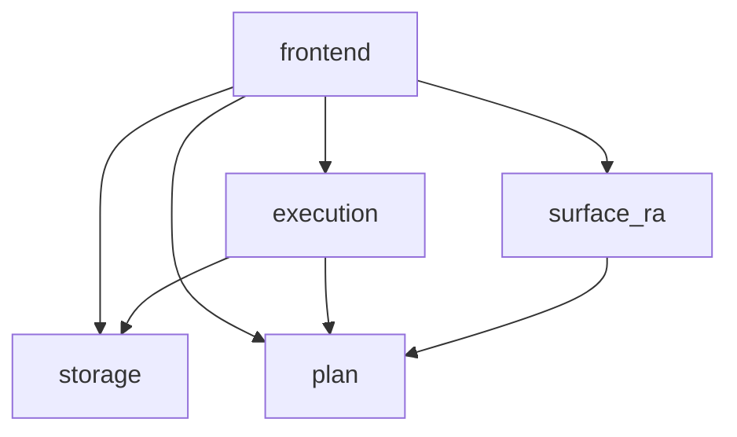

# Architecture

## Layers

The query pipeline runs top-to-bottom from text to rows and back to text.
The storage stack sits below it, used by `Eval` and the catalog.

```
  Query pipeline                                  Storage stack
  ──────────────                                  ─────────────

  "users | join orders on users.id = orders.user_id"
         │
         │  Parser   (angstrom)
         ▼
       Ast.t        — surface AST; mirrors syntax
         │
         │  Lower
         ▼
     Logical.t      — relational algebra; what the query computes
         │
         │  Translate
         ▼
     Physical.t     — physical operators; how to compute it
         │
         │  Eval ────────────────────────────►  Catalog       — name → Relation.kind
         ▼                                          │
     Term.t       — Scalar/Row/Relation/Catalog     │  uses
         │                                          ▼
         │  Term.format                         Encoding      — keys (byte-
         ▼                                          │          comparable),
       output                                       │          row values
                                                    │          (Marshal)
                                                    │  uses
                                                    ▼
                                                Storage       — LMDB env, txns,
                                                    │          byte-keyed maps
                                                    ▼
                                                  LMDB
```

`Demo_data` sits beside `Catalog` and the storage stack, seeding
the example `users` and `orders` tables through the public surface
(the `create table` and `insert into` pipe-form operators) when the
binary is launched with `--demo-data`. Production runs ship no
hardcoded rows; the seeder is opt-in.

Each layer in the diagram, in pipeline order:

| Layer       | Role                                                                                          |
| ----------- | --------------------------------------------------------------------------------------------- |
| `Parser`    | Parses surface syntax into an AST, built on `angstrom`.                                       |
| `Ast`       | Abstract syntax tree for the surface relational algebra language.                             |
| `Lower`     | Converts the AST into a relational algebra expression tree.                                   |
| `Logical`   | Relational algebra describing *what* the query computes, with no execution detail.            |
| `Translate` | Converts the relational algebra expression tree into a physical execution plan.               |
| `Physical`  | The concrete execution plan: cursors, filters, projections, joins, point lookups, and writes. |
| `Eval`      | Executes the physical plan and returns a `Term`.                                              |
| `Term`      | The thing returned by a query; either a scalar, row, relation, catalog, or type.              |

## Sub-libraries

The code under `lib/` is split into six sub-libraries, each its own dune
library.

| Library      | Responsibility                                                                                                                |
| ------------ | ----------------------------------------------------------------------------------------------------------------------------- |
| `core`       | Shared data types — `Scalar`, `Row`, `Relation`, `Term`, `Expression`, `Catalog` — the type ladder everything else builds on. |
| `storage`    | LMDB-backed persistence: the storage engine, key and row encoding, and the table catalog.                                     |
| `plan`       | Query-plan IRs and the optimiser: `Logical`, `Physical`, `Translate`, `Projection`.                                           |
| `surface_ra` | The surface language: parser, AST, and lowering to relational algebra.                                                        |
| `execution`  | The streaming evaluator that runs a physical plan against storage.                                                            |
| `frontend`   | The REPL, CLI, and demo-data seeder that tie the pipeline together.                                                           |

Internal dependencies between these sub-libraries are shown below. External
packages (`lmdb`, `unix`, `angstrom`) are omitted.

Every sub-library depends on `core`, so it is left off the diagram rather
than repeating the edge five times.


