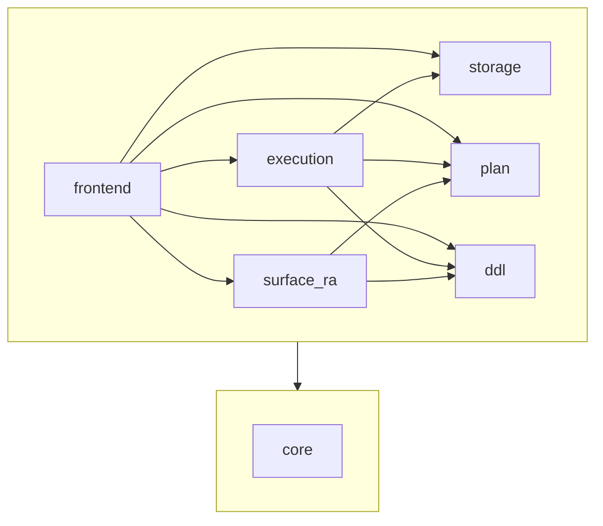

# Sub-library dependencies

Internal dependencies between the sub-libraries under `lib/`. External
packages (`lmdb`, `unix`, `angstrom`) are omitted.

`core` is depended on by every other sub-library, so the diagram shows
it as a foundation layer with a single arrow from the upper layer
rather than repeating the edge seven times.

