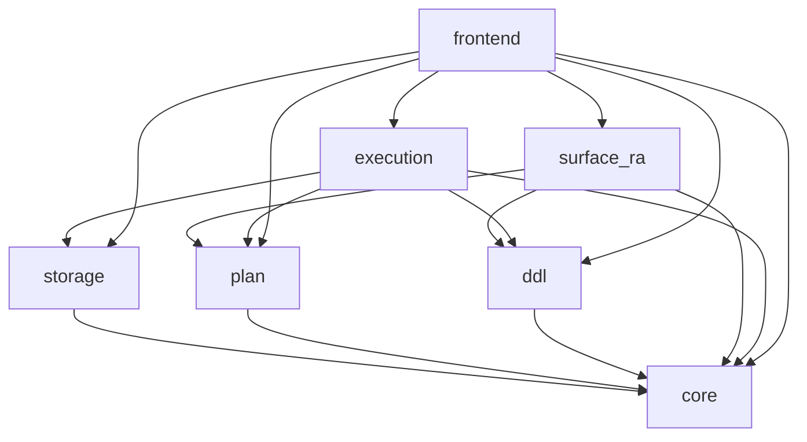

# Sub-library dependencies

Internal dependencies between the sub-libraries under `lib/`. External
packages (`lmdb`, `unix`, `angstrom`) are omitted.

```mermaid
graph TD
  core[core]
  storage[storage]
  plan[plan]
  ddl[ddl]
  surface_ra[surface_ra]
  execution[execution]
  frontend[frontend]

  storage --> core
  plan --> core
  ddl --> core

  surface_ra --> core
  surface_ra --> plan
  surface_ra --> ddl

  execution --> core
  execution --> storage
  execution --> plan
  execution --> ddl

  frontend --> core
  frontend --> storage
  frontend --> plan
  frontend --> ddl
  frontend --> surface_ra
  frontend --> execution
```
